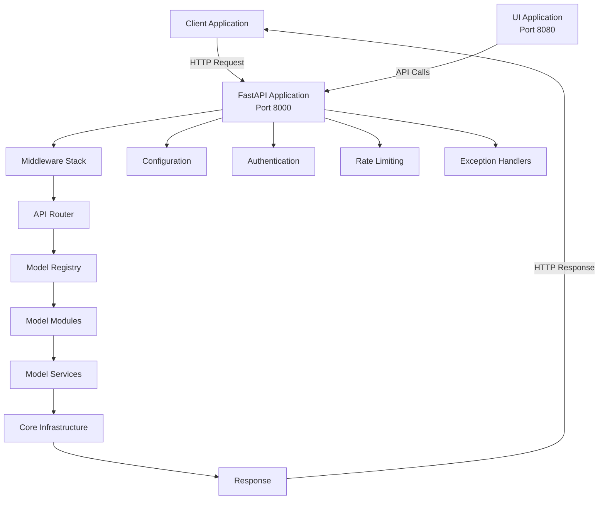
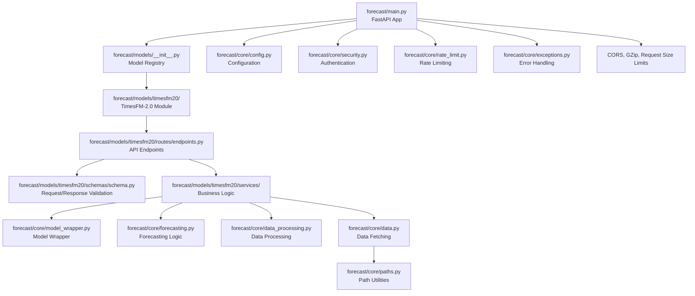

# Forecast Application - Architecture

Complete architecture documentation for the Sapheneia Forecast Application.

## Table of Contents

1. [Overview](#overview)
2. [System Architecture](#system-architecture)
3. [Component Diagram](#component-diagram)
4. [Request/Response Flow](#requestresponse-flow)
5. [Data Flow](#data-flow)
6. [Middleware Stack](#middleware-stack)
7. [Error Handling](#error-handling)
8. [Security Architecture](#security-architecture)
9. [Deployment Architecture](#deployment-architecture)
10. [State Management](#state-management)
11. [Model Registry System](#model-registry-system)
12. [Adding New Models](#adding-new-models)

## Overview

The Forecast Application is a multi-model, RESTful time series forecasting API built on FastAPI. The system is designed for:

- **Multi-Model Support**: Extensible architecture supporting multiple forecasting models (TimesFM-2.0, planned: Chronos, Prophet)
- **Production Ready**: Comprehensive error handling, logging, authentication, and monitoring
- **Flexible Deployment**: Support for both virtual environment and Docker deployments
- **Model Registry**: Centralized model discovery and management
- **State Management**: Module-level state management with clear limitations and future Redis backend support
- **High Performance**: Optimized for inference with thread pool execution and async support

## System Architecture

### High-Level Architecture



### Component Layers

1. **Client Layer**: External applications making API requests (including UI application)
2. **API Layer**: FastAPI application with routing, middleware, and endpoint definitions
3. **Model Registry Layer**: Centralized model discovery and registration system
4. **Model Module Layer**: Individual model implementations (TimesFM-2.0, future: Chronos, Prophet)
5. **Core Infrastructure Layer**: Shared utilities (data processing, forecasting, security, configuration)
6. **Data Layer**: Data fetching, validation, and transformation

## Component Diagram

### Module Relationships



### Component Responsibilities

**`forecast/main.py`**
- FastAPI application initialization
- Middleware configuration (CORS, GZip, Request Size Limits, Request ID, Performance Monitoring)
- Exception handler registration
- Model router inclusion
- Health check and discovery endpoints (`/`, `/health`, `/info`, `/models`)
- Startup and shutdown event handlers

**`forecast/models/__init__.py` (Model Registry)**
- Centralized model registration
- Model metadata management
- Model discovery functions (`get_available_models()`, `get_model_info()`, `get_all_models_info()`)
- Model status tracking

**`forecast/models/timesfm20/routes/endpoints.py`**
- TimesFM-2.0 API endpoint definitions
- Request validation
- Response formatting
- Rate limiting application
- Authentication enforcement
- Thread pool execution for CPU-bound operations

**`forecast/models/timesfm20/services/model.py`**
- Model initialization and state management
- Inference execution
- Model status tracking
- Thread-safe state access

**`forecast/models/timesfm20/services/data.py`**
- Model-specific data loading and transformation
- Data validation
- Covariates preparation

**`forecast/core/model_wrapper.py`**
- TimesFM model wrapper (`TimesFMModel` class)
- Model initialization from various sources (HuggingFace, local, MLflow)
- Model configuration management

**`forecast/core/forecasting.py`**
- Forecasting logic (`Forecaster` class)
- Basic and covariates-enhanced forecasting
- Quantile forecasting support
- Centralized forecast execution (`run_forecast()`)
- Quantile band processing (`process_quantile_bands()`)

**`forecast/core/data_processing.py`**
- Data processing and validation (`DataProcessor` class)
- CSV loading and parsing
- Data type inference and conversion
- Covariates preparation
- Visualization data preparation

**`forecast/core/data.py`**
- Data fetching from various sources (local files, HTTP URLs)
- Path normalization and security validation
- Support for future S3/GCS integration

**`forecast/core/paths.py`**
- Path handling utilities
- Environment detection (venv vs Docker)
- Path normalization and security validation
- Consistent behavior across deployment modes

**`forecast/core/config.py`**
- Application configuration management (Pydantic Settings)
- Environment variable loading
- Configuration validation
- Default values

**`forecast/core/security.py`**
- API key authentication
- Bearer token validation
- Security utilities

**`forecast/core/rate_limit.py`**
- Rate limiting configuration
- Endpoint-specific rate limits
- Rate limit storage (memory-based, future: Redis)

**`forecast/core/exceptions.py`**
- Custom exception hierarchy
- Structured error responses
- Error code management

## Request/Response Flow

### Standard Request Flow

```
1. Client sends HTTP request
   ↓
2. FastAPI receives request
   ↓
3. Middleware stack processes:
   - CORS validation
   - GZip compression (response)
   - Request size limit check
   - Request ID generation
   - Performance monitoring start
   ↓
4. Rate limiting check
   ↓
5. Authentication check (API key validation)
   ↓
6. Router matches endpoint
   ↓
7. Request validation (Pydantic schemas)
   ↓
8. Model service execution:
   - Data fetching (if needed)
   - Data processing and transformation
   - Model inference
   - Response formatting
   ↓
9. Performance monitoring end
   ↓
10. Response compression (if applicable)
   ↓
11. Response sent to client
```

### Model Initialization Flow

```
1. POST /forecast/v1/timesfm20/initialization
   ↓
2. Validate request (ModelInitInput schema)
   ↓
3. Check current model status
   ↓
4. Acquire model lock (thread-safe)
   ↓
5. Initialize model:
   - Load from HuggingFace/local/MLflow
   - Create TimesFMModel wrapper
   - Create Forecaster instance
   - Update model state
   ↓
6. Release model lock
   ↓
7. Return initialization status
```

### Inference Flow

```
1. POST /forecast/v1/timesfm20/inference
   ↓
2. Validate request (InferenceInput schema)
   ↓
3. Check model status (must be "ready")
   ↓
4. Submit to thread pool executor
   ↓
5. In thread pool:
   a. Fetch data source (local file or HTTP URL)
   b. Load and transform data (DataProcessor)
   c. Prepare covariates (if applicable)
   d. Run forecast (Forecaster.forecast())
   e. Process quantile bands (if requested)
   f. Prepare visualization data
   ↓
6. Return inference results
```

## Data Flow

### Data Source to Forecast Output

```
Data Source (CSV file or HTTP URL)
   ↓
fetch_data_source() [forecast/core/data.py]
   - Path normalization
   - Security validation
   - File/URL fetching
   ↓
Raw DataFrame
   ↓
load_and_transform_timesfm_data() [forecast/models/timesfm20/services/data.py]
   - Data validation
   - Data type conversion
   - Data definition validation
   ↓
DataProcessor.prepare_forecast_data() [forecast/core/data_processing.py]
   - Extract target series
   - Prepare covariates (dynamic/static, numerical/categorical)
   - Validate data length
   ↓
Target Inputs + Covariates Dictionary
   ↓
Forecaster.forecast() [forecast/core/forecasting.py]
   - Basic forecasting OR
   - Covariates-enhanced forecasting
   ↓
Point Forecast + Quantile Forecast (numpy arrays)
   ↓
process_quantile_bands() [forecast/core/forecasting.py]
   - Sort quantiles
   - Create quantile band dictionary
   ↓
prepare_visualization_data() [forecast/core/data_processing.py]
   - Historical data
   - Future dates
   - Target name
   ↓
InferenceOutput [forecast/models/timesfm20/schemas/schema.py]
   - Prediction data
   - Visualization data
   - Execution metadata
```

## Middleware Stack

The middleware stack processes requests in the following order:

1. **CORS Middleware** (`CORSMiddleware`)
   - Validates origin against allowed origins
   - Handles preflight OPTIONS requests
   - Adds CORS headers to responses

2. **GZip Compression** (`GZipMiddleware`)
   - Compresses responses larger than 1KB
   - Reduces bandwidth usage

3. **Request Size Limit** (Custom middleware)
   - Enforces maximum request body size (10MB default)
   - Prevents oversized requests

4. **Request ID** (Custom middleware)
   - Generates unique request ID for each request
   - Adds `X-Request-ID` header to responses
   - Enables request tracing in logs

5. **Performance Monitoring** (Custom middleware)
   - Tracks request processing time
   - Adds `X-Process-Time` header to responses
   - Logs slow requests

## Error Handling

### Exception Hierarchy

```
SapheneiaException (base)
├── ModelError
│   ├── ModelNotInitializedError
│   ├── ModelInitializationError
│   └── ModelInferenceError
├── DataError
│   ├── DataFetchError
│   ├── DataValidationError
│   └── DataProcessingError
└── ConfigurationError
```

### Error Response Format

All errors return structured JSON responses:

```json
{
  "error": "ERROR_CODE",
  "message": "Human-readable error message",
  "details": {
    "field": "Additional error details"
  }
}
```

### Exception Handlers

1. **SapheneiaException Handler**: Handles all custom exceptions with appropriate status codes
2. **RateLimitExceeded Handler**: Handles rate limit violations (429 status)
3. **Generic Exception Handler**: Catches unexpected exceptions (500 status)

## Security Architecture

### Authentication

- **Method**: HTTP Bearer Token (API Key)
- **Implementation**: `forecast/core/security.py`
- **Validation**: All model endpoints require valid API key
- **Public Endpoints**: `/`, `/health`, `/info`, `/models` (no authentication required)

### API Key Configuration

- **Environment Variable**: `API_SECRET_KEY`
- **Default**: `"default_secret_key_please_change"` (must be changed in production)
- **Validation**: Pydantic validator checks for default key in production environment

### Security Features

- **Path Traversal Protection**: `normalize_data_path()` validates paths and prevents directory traversal
- **Request Size Limits**: Prevents oversized requests (10MB body, 50MB upload)
- **CORS Configuration**: Restricts allowed origins
- **Rate Limiting**: Prevents abuse and DoS attacks

## Deployment Architecture

### Virtual Environment Deployment

```
User Machine
├── Python 3.11+
├── uv package manager
├── .venv/ (virtual environment)
│   └── Dependencies installed
└── Application runs directly
    ├── forecast/main.py (FastAPI app)
    └── Accessible at http://localhost:8000
```

### Docker Deployment

```
Docker Container
├── Base Image: Python 3.11
├── Application Code: /app/forecast/
├── Data Directory: /app/data/
├── Model Cache: /app/forecast/models/timesfm20/local/
└── Exposed Port: 8000
```

### Docker Compose Deployment

```
docker-compose.yml
├── forecast service
│   ├── Dockerfile.forecast
│   ├── Port: 8000
│   └── Volumes: ./forecast, ./data
└── ui service
    ├── Dockerfile.ui
    ├── Port: 8080
    └── Depends on: forecast
```

### Multi-Model Deployment Options

1. **Single API Gateway** (Default)
   - All models accessible via http://localhost:8000
   - Endpoints: `/forecast/v1/timesfm20/*`, `/forecast/v1/chronos/*`, etc.
   - Easiest for orchestrators and load balancers

2. **Separate Model Services** (Optional)
   - Each model runs in its own container on dedicated port
   - TimesFM: http://localhost:8001
   - Chronos: http://localhost:8002
   - Prophet: http://localhost:8003
   - Enable by uncommenting services in `docker-compose.yml`

## State Management

### Current Implementation: Module-Level State

The forecast application uses **module-level state** for model instances. Each model module maintains its state at the module level:

```python
# forecast/models/timesfm20/services/model.py
_forecaster_instance: Optional[Forecaster] = None
_model_wrapper: Optional[TimesFMModel] = None
_model_status: str = "uninitialized"
_model_lock = threading.Lock()  # Thread-safe access
```

### Limitations

⚠️ **IMPORTANT**: The current state management has the following limitations:

- **Single Worker Only**: Each model service must run with `UVICORN_WORKERS=1`
- **No Horizontal Scaling**: Cannot run multiple instances of the same model with shared state
- **State Non-Persistent**: Model state is lost on process restart
- **Memory Isolation**: Each container has its own isolated state

### What Works

✅ **Multiple Different Models**: You can run TimesFM, Chronos, and Prophet simultaneously in separate containers  
✅ **Concurrent Requests**: Single worker handles concurrent requests safely (with thread locks)  
✅ **Model Isolation**: Each model's state is completely isolated from others

### What Doesn't Work

❌ **Multiple Workers per Model**: Running `--workers 4` will cause state conflicts  
❌ **Horizontal Scaling**: Cannot load-balance across multiple containers of the same model  
❌ **Parallel Benchmarking**: Cannot run parallel tasks on the same model instance

### Future Solution: Redis State Backend

For production deployments requiring:
- High throughput (multiple workers per model)
- Horizontal scaling (multiple containers per model)
- Parallel benchmarking and testing
- State persistence across restarts

**→ Implement Redis state backend** (see `CODEREVIEWREMEDIATION.md` Phase 4, Task 4.3)

This will enable:
- Distributed state management across processes
- Multiple workers: `UVICORN_WORKERS=4+`
- Horizontal scaling with load balancing
- Persistent state storage
- Distributed locking for thread safety

## Model Registry System

### Overview

The model registry (`forecast/models/__init__.py`) provides centralized model discovery and management.

### Registry Structure

```python
MODEL_REGISTRY = {
    "timesfm20": {
        "name": "TimesFM 2.0",
        "version": "2.0.500m",
        "description": "Google's TimesFM 2.0 - 500M parameter foundation model",
        "module": "forecast.models.timesfm20",
        "router_path": "forecast.models.timesfm20.routes.endpoints",
        "service_path": "forecast.models.timesfm20.services.model",
        "default_port": 8001,
        "status": "active"
    }
}
```

### Registry Functions

- `get_available_models()`: Returns list of active model IDs
- `get_model_info(model_id)`: Returns metadata for specific model
- `get_all_models_info()`: Returns complete registry

### Model Status

- `"active"`: Model is available and ready to use
- `"planned"`: Model is registered but not yet implemented
- `"deprecated"`: Model is available but no longer recommended

## Adding New Models

### Step-by-Step Guide

**Example: Adding Chronos**

1. **Create model directory structure:**
```bash
mkdir -p forecast/models/chronos/{routes,schemas,services,local,documentation}
```

2. **Implement model code:**
   - Copy structure from `forecast/models/timesfm20/`
   - Implement Chronos-specific logic
   - Update imports and schemas

3. **Register in model registry:**
```python
# forecast/models/__init__.py
MODEL_REGISTRY = {
    # ... existing models ...
    "chronos": {
        "name": "Chronos",
        "version": "1.0",
        "description": "Amazon Chronos forecasting model",
        "module": "forecast.models.chronos",
        "router_path": "forecast.models.chronos.routes.endpoints",
        "service_path": "forecast.models.chronos.services.model",
        "default_port": 8002,
        "status": "active"
    }
}
```

4. **Import router in main.py:**
```python
from .models.chronos.routes import endpoints as chronos_endpoints
app.include_router(chronos_endpoints.router, prefix="/forecast/v1")
```

5. **Update Dockerfile (optional):**
```dockerfile
# In Dockerfile.forecast
RUN if [ "$MODEL_NAME" = "chronos" ] || [ "$MODEL_NAME" = "all" ]; then \
        uv pip install --system chronos-forecasting; \
    fi
```

6. **Test:**
```bash
curl http://localhost:8000/models
# Should show both timesfm20 and chronos
```

### Model Module Structure

Each model module should follow this structure:

```
forecast/models/{model_id}/
├── __init__.py
├── routes/
│   ├── __init__.py
│   └── endpoints.py          # API endpoints
├── schemas/
│   ├── __init__.py
│   └── schema.py             # Pydantic schemas
├── services/
│   ├── __init__.py
│   ├── model.py              # Model service
│   └── data.py               # Data service
├── local/                     # Local model artifacts
├── tests/                     # Model-specific tests
└── documentation/             # Model-specific documentation
```

### Model Service Requirements

Each model service must implement:

- `initialize_model()`: Initialize model from source
- `get_status()`: Return model status and error message
- `get_model_config()`: Return model configuration
- `get_model_source_info()`: Return model source information
- `run_inference()`: Execute inference (if applicable)
- `shutdown_model()`: Clean up model resources

---

**See also:**
- [API Usage Guide](API_USAGE.md) - How to use the API
- [Deployment Guide](DEPLOYMENT.md) - Deployment instructions
- [Model Registry Guide](MODEL_REGISTRY.md) - Detailed model registry documentation
- [TimesFM-2.0 Architecture](../models/timesfm20/documentation/ARCHITECTURE.md) - Model-specific architecture

