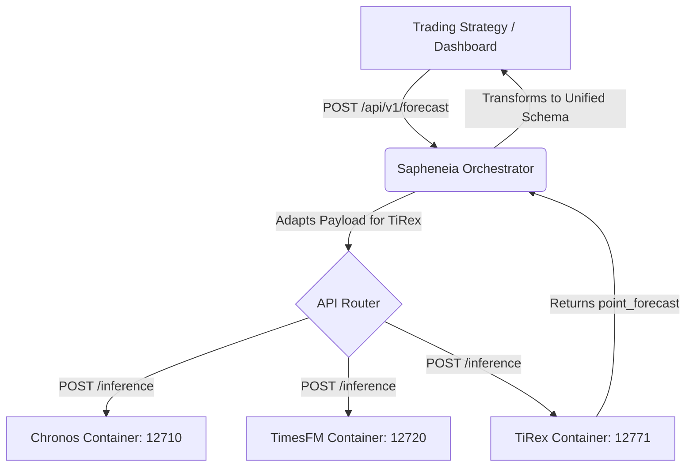

# TiRex Architecture Integration

The TiRex model is integrated into the Sapheneia ecosystem as an independent, containerized predictive service. This document outlines the component architecture that securely connects the zero-shot TiRex models to the unified orchestration gateway.

## 1. High-Level Architecture

TiRex operates exclusively on a request/response REST architecture via a dedicated FastAPI server. Like Chronos and TimesFM, it does not process data pipelines or broker messages directly; instead, it acts as a lightweight numerical inference engine.

## 2. Component Design

The `tirex` module is self-contained within `forecast/models/tirex/` and consists of three internal layers:

### A. Routes (`routes/endpoints.py`)
Exposes the physical FastAPI endpoints (`/initialization`, `/status`, `/inference`, `/shutdown`). These routes rely heavily on dependency injection for API key validation and model state tracking.

### B. Schemas (`schemas/schema.py`)
Utilizes Pydantic `BaseModel` classes with explicit `@field_validator` annotations to guarantee type safety.
- **`ModelInitInput`**: Validates `model_variant` and ensures `device` requests only `"cpu"` or `"cuda"`. Rejecting unsupported devices at this layer prevents downstream unhandled PyTorch `500 Server Errors`.
- **`InferenceInput`**: Requires an explicit `context` historical float array and a positive `prediction_length`.

### C. Services (`services/model.py`)
The execution layer that communicates natively with the `tirex_ts` Hugging Face integrations. It maps the container's loaded context against PyTorch tensors and extracts the raw `point_forecast` array payload required by Sapheneia adapters.

## 3. Orchestrator Integration

Because external Sapheneia systems (such as `aleutian evaluate run`) operate on a generalized "Unified Inference Schema" containing complex date frequencies and horizon blocks, TiRex's raw Pydantic schemas are shielded via two gateway adapters in `orchestration/adapters.py`:

1. **`inference_to_tirex(request: InferenceRequest) -> Dict[str, Any]`**: 
   Strips complex frequency identifiers and extracts the raw float array into TiRex's `"context"` list. Re-maps `"horizon.length"` to `"prediction_length"`.

2. **`tirex_to_inference(response: Dict[str, Any], ...) -> InferenceResponse`**: 
   Intercepts the raw `"point_forecast"` numerical array and wraps it with execution metadata (timestamps, processing latency, model variant) dynamically back into the strict `InferenceResponse` JSON schema expected by the frontend UI and backtesting engine.
