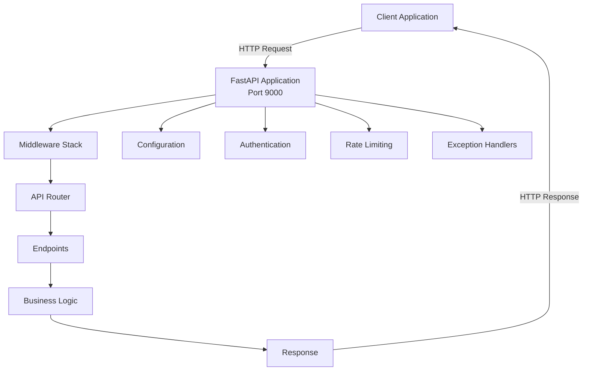
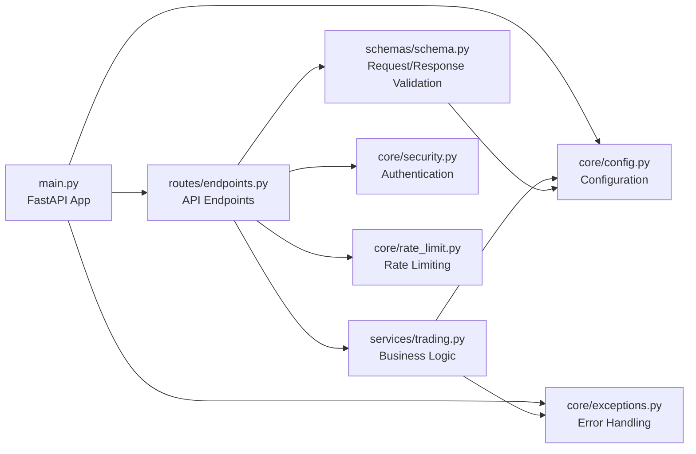
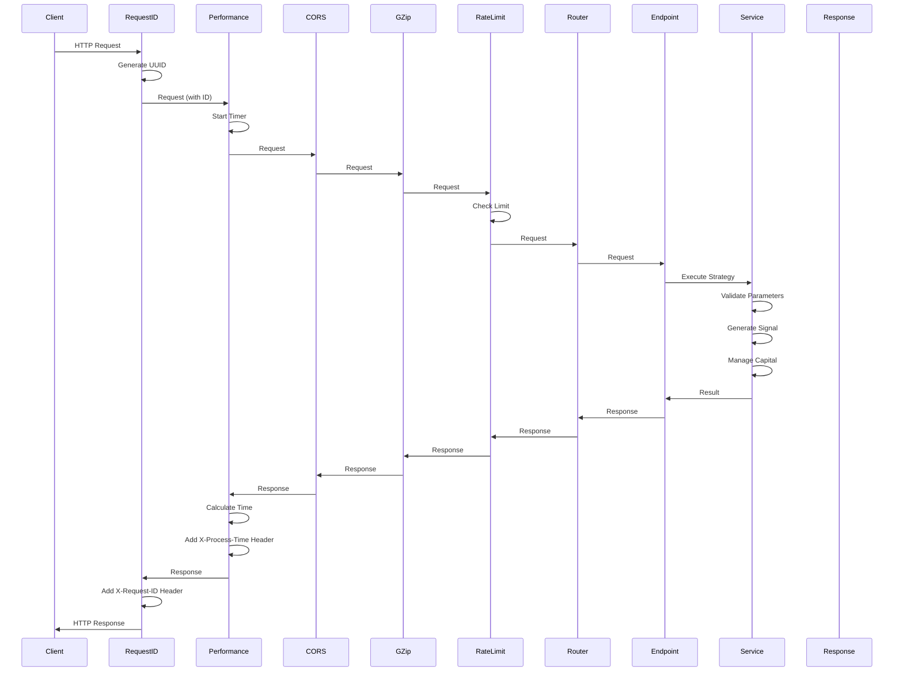
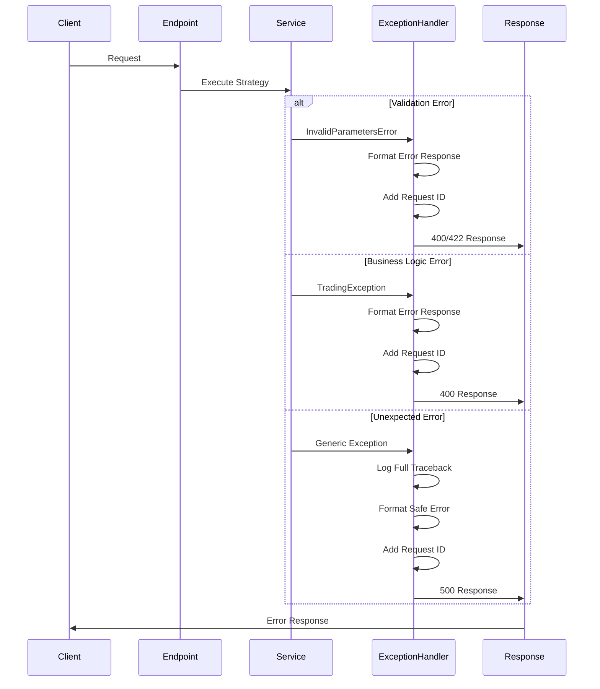
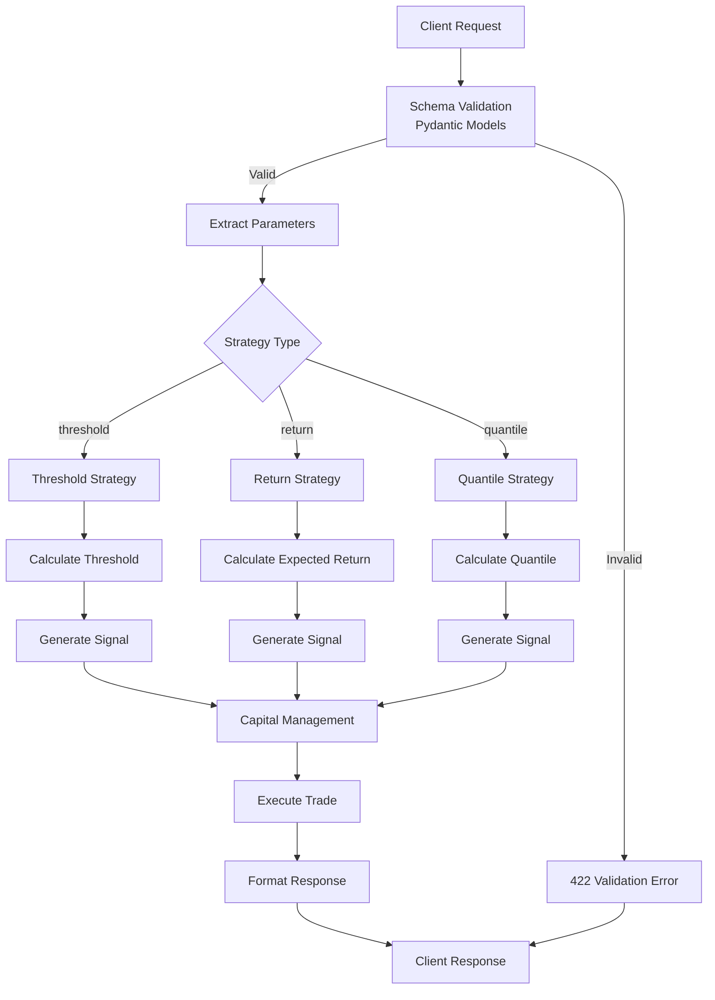
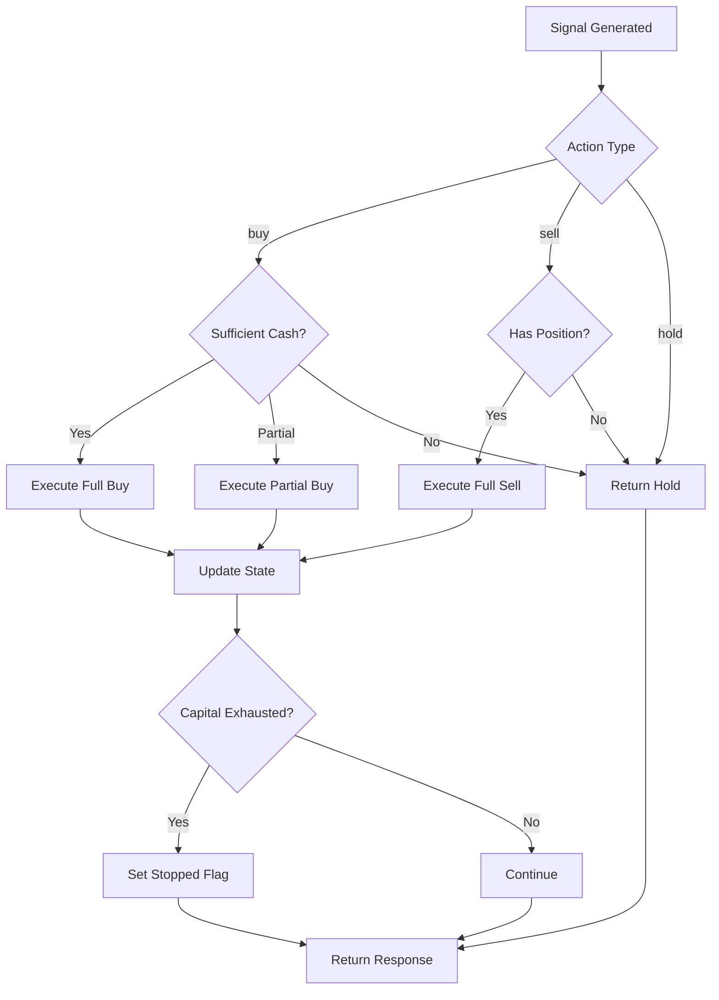
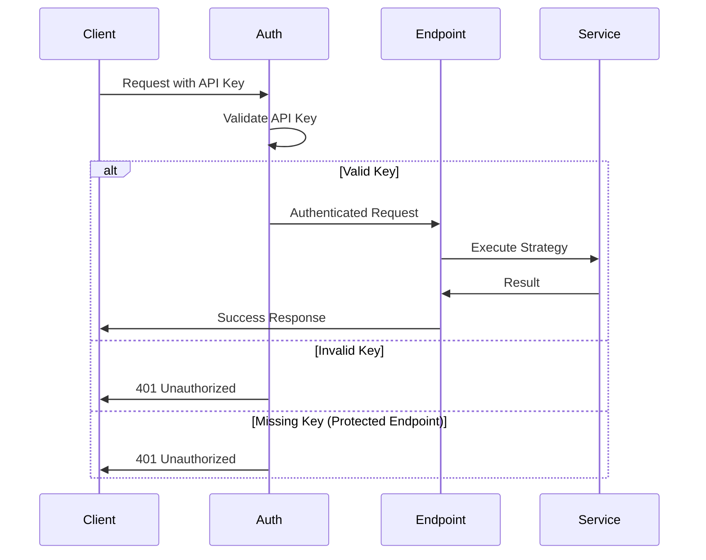

# Trading Strategies API - Architecture

Complete architecture documentation for the Trading Strategies API.

## Table of Contents

1. [Overview](#overview)
2. [System Architecture](#system-architecture)
3. [Component Diagram](#component-diagram)
4. [Request/Response Flow](#requestresponse-flow)
5. [Data Flow](#data-flow)
6. [Middleware Stack](#middleware-stack)
7. [Error Handling](#error-handling)
8. [Security Architecture](#security-architecture)
9. [Deployment Architecture](#deployment-architecture)

## Overview

The Trading Strategies API is a stateless, RESTful service built on FastAPI that provides trading strategy execution capabilities. The system is designed for:

- **Stateless Operations**: All state (position, capital) is provided in each request
- **Long-Only Positions**: No short selling allowed
- **Capital Management**: Automatic handling of insufficient capital scenarios
- **High Performance**: Sub-100ms response times for typical requests
- **Production Ready**: Comprehensive error handling, logging, and monitoring

## System Architecture

### High-Level Architecture



### Component Layers

1. **Client Layer**: External applications making API requests
2. **API Layer**: FastAPI application with routing and middleware
3. **Business Logic Layer**: Trading strategy execution logic
4. **Data Layer**: Input validation and response formatting

## Component Diagram

### Module Relationships



### Component Responsibilities

**`main.py`**
- FastAPI application initialization
- Middleware configuration (CORS, GZip, Request ID, Performance)
- Exception handler registration
- Router inclusion
- Health check endpoints

**`routes/endpoints.py`**
- API endpoint definitions
- Request validation
- Response formatting
- Rate limiting application
- Authentication enforcement

**`services/trading.py`**
- Trading strategy execution logic
- Signal generation algorithms
- Capital management
- Position sizing calculations
- Strategy-specific computations

**`schemas/schema.py`**
- Pydantic models for request validation
- Response schema definitions
- Field validators and constraints
- Discriminated unions for strategy routing

**`core/config.py`**
- Application settings management
- Environment variable handling
- Configuration validation
- Constants definition

**`core/security.py`**
- API key authentication
- Bearer token validation
- Security scheme definition

**`core/rate_limit.py`**
- Rate limiting configuration
- Limit enforcement
- Custom rate limit handlers

**`core/exceptions.py`**
- Custom exception hierarchy
- Error response formatting
- Status code mapping

## Request/Response Flow

### Standard Request Flow



### Error Handling Flow



## Data Flow

### Strategy Execution Data Flow



### Capital Management Flow



## Middleware Stack

### Execution Order

The middleware stack executes in the following order (top to bottom):

1. **Request ID Middleware**
   - Generates unique UUID for each request
   - Stores in `request.state.request_id`
   - Adds `X-Request-ID` header to responses
   - Logs request start/completion

2. **Performance Monitoring Middleware**
   - Measures request processing time
   - Adds `X-Process-Time` header (milliseconds)
   - Logs slow requests (>100ms threshold)
   - Includes request ID in logs

3. **CORS Middleware**
   - Handles cross-origin requests
   - Configurable allowed origins
   - Adds CORS headers to responses

4. **GZip Middleware**
   - Compresses responses >1KB
   - Reduces bandwidth usage
   - Automatic content negotiation

5. **Request Size Limit Middleware**
   - Enforces maximum request size (10MB)
   - Protects against resource exhaustion
   - Returns 413 for oversized requests

6. **Rate Limiting**
   - Enforced at endpoint level
   - Different limits per endpoint type
   - Returns 429 when exceeded

### Middleware Configuration

```python
# Execution order (as registered in main.py)
1. Request ID Middleware (custom)
2. Performance Monitoring Middleware (custom)
3. CORS Middleware (FastAPI)
4. GZip Middleware (FastAPI)
5. Request Size Limit Middleware (custom)
6. Rate Limiting (slowapi, per-endpoint)
```

## Error Handling

### Exception Hierarchy

```
TradingException (base)
├── InvalidStrategyError
├── InsufficientCapitalError
├── InvalidParametersError
└── StrategyStoppedError
```

### Error Response Format

All errors follow a consistent format:

```json
{
  "error": "ERROR_CODE",
  "message": "Human-readable error message",
  "details": {
    "request_id": "uuid-here",
    "parameter": "parameter_name",
    "value": "invalid_value"
  }
}
```

### Error Handling Flow

1. **Validation Errors** (422)
   - Pydantic schema validation failures
   - Field constraint violations
   - Model validator failures

2. **Business Logic Errors** (400)
   - Invalid strategy parameters
   - Insufficient capital
   - Strategy stopped

3. **Authentication Errors** (401)
   - Missing API key
   - Invalid API key

4. **Rate Limit Errors** (429)
   - Too many requests
   - Custom rate limit handler

5. **Server Errors** (500)
   - Unexpected exceptions
   - Internal errors
   - Safe error messages (no internal details exposed)

## Security Architecture

### Authentication

- **Method**: HTTP Bearer Token
- **Header**: `Authorization: Bearer <API_KEY>`
- **Validation**: Compares against `TRADING_API_KEY` from configuration
- **Required**: For `/trading/execute` endpoint
- **Optional**: For public endpoints (`/health`, `/trading/strategies`, `/trading/status`)

### Security Features

1. **API Key Authentication**
   - Minimum 32 characters in production
   - Validated on protected endpoints
   - Stored in environment variables

2. **Input Validation**
   - Pydantic schema validation
   - Type checking
   - Range validation
   - Custom validators

3. **Rate Limiting**
   - Prevents abuse
   - Configurable limits per endpoint
   - Memory-based storage (can use Redis)

4. **Request Size Limits**
   - Maximum 10MB request size
   - Protects against DoS attacks

5. **CORS Configuration**
   - Configurable allowed origins
   - Credential support
   - Method restrictions

### Security Flow



## Deployment Architecture

### Local Development

```
┌─────────────────────────────────────┐
│  Development Environment            │
│                                     │
│  ┌──────────────────────────────┐  │
│  │  Python Virtual Environment  │  │
│  │  (uv venv)                   │  │
│  └──────────────────────────────┘  │
│           │                         │
│           ▼                         │
│  ┌──────────────────────────────┐  │
│  │  FastAPI Application         │  │
│  │  (uvicorn)                   │  │
│  │  Port: 9000                  │  │
│  └──────────────────────────────┘  │
└─────────────────────────────────────┘
```

### Docker Deployment

```
┌─────────────────────────────────────┐
│  Docker Container                   │
│                                     │
│  ┌──────────────────────────────┐  │
│  │  Python 3.11-slim            │  │
│  │  ┌────────────────────────┐  │  │
│  │  │  Trading API          │  │  │
│  │  │  Port: 9000           │  │  │
│  │  └────────────────────────┘  │  │
│  └──────────────────────────────┘  │
│           │                         │
│           ▼                         │
│  ┌──────────────────────────────┐  │
│  │  Host Port Mapping          │  │
│  │  9000:9000                  │  │
│  └──────────────────────────────┘  │
└─────────────────────────────────────┘
```

### Docker Compose Integration

```yaml
services:
  trading:
    build: Dockerfile.trading
    ports:
      - "9000:9000"
    environment:
      - TRADING_API_KEY
      - TRADING_API_HOST=0.0.0.0
      - TRADING_API_PORT=9000
    networks:
      - sapheneia-network
    healthcheck:
      - http://localhost:9000/health
```

### Production Deployment

```
┌─────────────────────────────────────┐
│  Load Balancer / Reverse Proxy      │
│  (nginx, traefik, etc.)             │
└──────────────┬──────────────────────┘
               │
       ┌───────┴───────┐
       │               │
┌──────▼──────┐  ┌─────▼──────┐
│  Container  │  │  Container │
│  Instance 1 │  │  Instance 2 │
│  Port: 9000 │  │  Port: 9000 │
└─────────────┘  └─────────────┘
```

## Key Design Decisions

### Stateless Design

- **Rationale**: Simplifies scaling and deployment
- **Implementation**: All state provided in each request
- **Benefits**: No session management, easy horizontal scaling

### Long-Only Positions

- **Rationale**: Simplifies capital management
- **Implementation**: Enforced in business logic
- **Benefits**: Clearer risk management, simpler validation

### Middleware Order

- **Rationale**: Request ID must be first for correlation
- **Implementation**: Explicit ordering in `main.py`
- **Benefits**: Consistent logging and debugging

### Configuration Management

- **Rationale**: Centralized configuration improves maintainability
- **Implementation**: Pydantic Settings with environment variables
- **Benefits**: Type safety, validation, easy deployment

### Error Handling

- **Rationale**: Consistent error responses improve API usability
- **Implementation**: Custom exception hierarchy with structured responses
- **Benefits**: Better debugging, support ticket correlation

## Performance Characteristics

- **Response Time**: <100ms for typical requests
- **Throughput**: Handles 60 requests/minute (default rate limit)
- **Concurrency**: Stateless design supports high concurrency
- **Memory**: Minimal memory footprint (no state storage)
- **CPU**: Efficient numpy-based calculations

## Scalability

- **Horizontal Scaling**: Stateless design enables easy horizontal scaling
- **Load Balancing**: Multiple instances can run behind a load balancer
- **Rate Limiting**: Can use Redis for distributed rate limiting
- **Resource Usage**: Low resource requirements per instance

## Monitoring and Observability

- **Request ID Tracking**: Every request has unique UUID
- **Performance Monitoring**: Process time in response headers
- **Structured Logging**: All logs include request ID
- **Health Checks**: `/health` endpoint for monitoring
- **Error Tracking**: Request ID in all error responses

## Future Enhancements

Potential future improvements:

- **Distributed Rate Limiting**: Redis-based rate limiting
- **Metrics Export**: Prometheus metrics endpoint
- **Tracing**: OpenTelemetry integration
- **Caching**: Optional result caching for repeated requests
- **Batch Processing**: Batch execution endpoint
- **WebSocket Support**: Real-time strategy execution

---

**Last Updated**: 2025-11-13  
**Version**: 1.0.0

